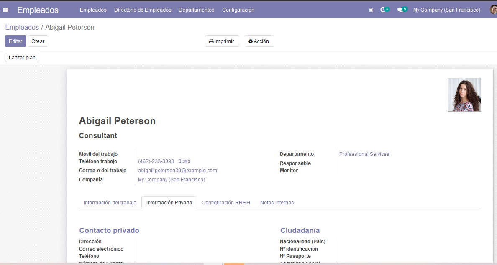
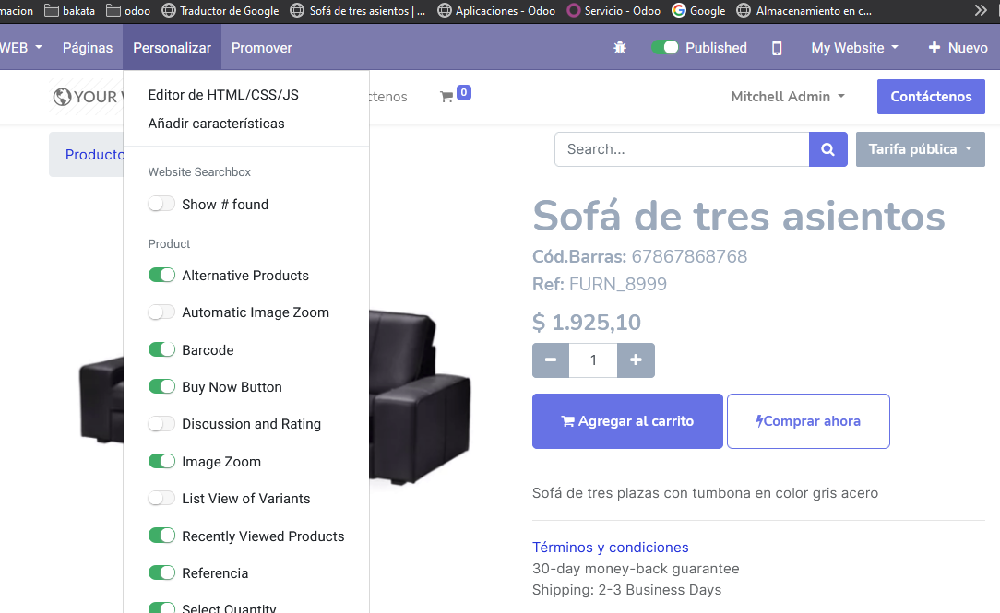

# odoo
<h4>hr_add_data</h4>
<h5>Añade dos campos NºPasaporte y la pestaña Notas Internas en Empleados</h5>
 
<h4>website_sale_add_data</h4>
<h5>Añade los campos Referencia y Cód.Barras con sus respectivos botones a la vista de producto en la tienda de Comercio electrónico</h5>

<h4>odoo-re</h4>
<h5>Script bash, para el reinicio del sistema odoo de forma rápida</h5>
<h4>odoo-up</h4>
<h5>Script bash, para la actualización de un módulo en el sistema odoo de forma rápida</h5>
